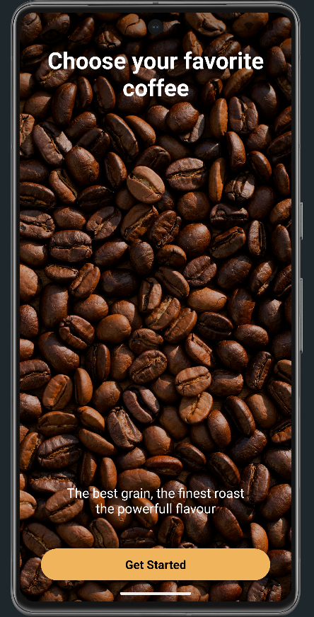

☕ CoffeeGo — Mobile Coffee Shop App
Savor the Experience, One Cup at a Time

🔍 Overview
CoffeeGo is a sleek and modern Android mobile application built with Kotlin, designed to offer an engaging coffee ordering experience. The app features intuitive UI, dynamic cart functionality, role-based access (user/admin), and Firebase integration for seamless backend communication.

🛠️ Built With
Kotlin – Modern, expressive language for Android development

Firebase – Authentication, Realtime Database, and storage

RecyclerView – For efficient list rendering (cart, menu)

XML Layouts – For responsive and beautiful UI

MVVM Pattern – Clean architecture and separation of concerns

Android Studio – Primary development IDE

📱 Features
🔐 Login & Registration with Firebase Authentication

🧾 Role-based Redirection (User → Home, Admin → Dashboard)

🛍️ Add to Cart system using RecyclerView and TinyDB

✅ Place Orders and view status updates

📡 Realtime Database integration with Firebase

👤 User Profile with branding and app visuals

🚀 Getting Started
🧰 Prerequisites
Make sure you have:

Android Studio installed

Firebase project created and linked

Kotlin SDK setup

Internet connection enabled for Firebase

🔧 Installation
Clone the repository
git clone https://github.com/deaamanii/MobileApplication
Open the project in Android Studio
Connect Firebase via Tools > Firebase
Sync Gradle and run the project on emulator/device

▶️ Usage
Register a user or admin

Add items to cart

Manage quantity dynamically

Admin can access dashboard and see all orders

Checkout and view status update

🧪 Testing
Basic functionality testing can be done on-device:
MainRepository

📸 Screenshots

👥 Authors
Dea Mani – Android Developer, Project Manager, Firebase Integration

Elsa Morina – Android Developer, Testing & Quality Assurance (QA)

Era Gashi –  Android Developer, UI/UX Design

Adi Berisha – Android Developer, Cart System
